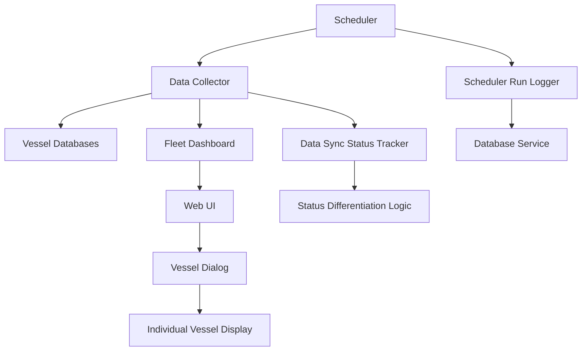

# Design Document

## Overview

This design document outlines the architecture and implementation approach for enhancing the vessel monitoring dashboard with individual vessel visibility, scheduler run logging, and improved data synchronization status differentiation. The solution will extend the existing monitoring system to provide better operational visibility and distinguish between actual downtime and data sync issues.

## Architecture

### High-Level Architecture

The enhancements will build upon the existing monitoring architecture with the following key additions:

1. **Scheduler Run Logging Service**: New service to track and persist scheduler execution history
2. **Enhanced Vessel Dialog**: Modified UI components to display individual vessels with IP addresses
3. **Data Sync Status Tracking**: Enhanced status differentiation logic in data collection
4. **Retry Mechanism**: Improved scheduler with automatic retry capabilities for failed vessel queries

### Component Interaction Flow



## Components and Interfaces

### 1. Scheduler Run Logger Service

**Purpose**: Track and persist scheduler execution history with detailed metrics

**Key Methods**:
- `log_run_start(run_id: str, vessel_count: int) -> None`
- `log_vessel_query_result(run_id: str, vessel_id: str, success: bool, error: str = None) -> None`
- `log_run_completion(run_id: str, success: bool, duration: timedelta) -> None`
- `get_recent_runs(limit: int = 20) -> List[SchedulerRunLog]`
- `get_run_details(run_id: str) -> SchedulerRunDetails`

**Database Schema**:
```sql
CREATE TABLE scheduler_runs (
    id TEXT PRIMARY KEY,
    start_time TIMESTAMP NOT NULL,
    end_time TIMESTAMP,
    total_vessels INTEGER NOT NULL,
    successful_vessels INTEGER DEFAULT 0,
    failed_vessels INTEGER DEFAULT 0,
    retry_attempts INTEGER DEFAULT 0,
    status TEXT NOT NULL, -- 'running', 'completed', 'failed'
    duration_seconds REAL,
    error_message TEXT
);

CREATE TABLE scheduler_vessel_results (
    id INTEGER PRIMARY KEY AUTOINCREMENT,
    run_id TEXT NOT NULL,
    vessel_id TEXT NOT NULL,
    attempt_number INTEGER NOT NULL,
    success BOOLEAN NOT NULL,
    query_duration_seconds REAL,
    error_message TEXT,
    timestamp TIMESTAMP DEFAULT CURRENT_TIMESTAMP,
    FOREIGN KEY (run_id) REFERENCES scheduler_runs (id)
);
```

### 2. Enhanced Data Models

**SchedulerRunLog**:
```python
@dataclass
class SchedulerRunLog:
    run_id: str
    start_time: datetime
    end_time: Optional[datetime]
    total_vessels: int
    successful_vessels: int
    failed_vessels: int
    retry_attempts: int
    status: str  # 'running', 'completed', 'failed'
    duration: Optional[timedelta]
    error_message: Optional[str]
```

**VesselQueryResult**:
```python
@dataclass
class VesselQueryResult:
    vessel_id: str
    attempt_number: int
    success: bool
    query_duration: timedelta
    error_message: Optional[str]
    timestamp: datetime
```

**Enhanced DeviceStatus** (already exists but will be utilized):
```python
@dataclass
class DeviceStatus:
    ip_address: str
    uptime_percentage: float
    current_status: OperationalStatus
    downtime_aging: timedelta
    last_ping_time: datetime
    has_data: bool  # Key field for data sync status
    ping_count: int
    successful_pings: int
```

### 3. Enhanced Scheduler Service

**Retry Logic Implementation**:
- Maximum 3 retry attempts per failed vessel
- Exponential backoff between retries (1s, 2s, 4s)
- Continue with remaining vessels after individual failures
- Separate logging for initial attempts vs retries

**Key Enhancements**:
```python
async def execute_daily_monitoring_with_retry(self) -> SchedulerRunResult:
    run_id = self._generate_run_id()
    vessel_ids = self.config.get_vessel_ids()
    
    # Log run start
    await self.run_logger.log_run_start(run_id, len(vessel_ids))
    
    successful_vessels = []
    failed_vessels = []
    
    # Initial attempt for all vessels
    for vessel_id in vessel_ids:
        result = await self._query_vessel_with_logging(run_id, vessel_id, attempt=1)
        if result.success:
            successful_vessels.append(vessel_id)
        else:
            failed_vessels.append(vessel_id)
    
    # Retry failed vessels
    retry_attempt = 2
    while failed_vessels and retry_attempt <= 3:
        remaining_failed = []
        for vessel_id in failed_vessels:
            await asyncio.sleep(2 ** (retry_attempt - 2))  # Exponential backoff
            result = await self._query_vessel_with_logging(run_id, vessel_id, retry_attempt)
            if result.success:
                successful_vessels.append(vessel_id)
            else:
                remaining_failed.append(vessel_id)
        
        failed_vessels = remaining_failed
        retry_attempt += 1
    
    # Log completion
    await self.run_logger.log_run_completion(run_id, len(failed_vessels) == 0)
```

### 4. Enhanced Fleet Dashboard Service

**Individual Vessel Display**:
- Modify `get_vessel_summaries()` to include device-level details
- Add IP address information to vessel data
- Enhance vessel detail retrieval with device breakdown

**Data Sync Status Logic**:
```python
def determine_sync_status(self, component_status: ComponentStatus) -> str:
    if not component_status.has_data:
        return "no_data"
    elif component_status.current_status == OperationalStatus.DOWN:
        return "confirmed_down"
    elif component_status.uptime_percentage < 50:
        return "sync_failed"
    else:
        return "operational"
```

### 5. Enhanced Web UI Components

**Vessel Dialog Enhancements**:
- Replace device type groupings with individual vessel listings
- Display IP addresses for each device within components
- Add scheduler run log section
- Implement status differentiation with distinct visual styling

**New UI Sections**:
1. **Individual Vessel List**: Shows each vessel with IP addresses
2. **Scheduler Run Log**: Displays recent execution history
3. **Data Sync Status Indicators**: Visual differentiation between no data, sync failed, and confirmed downtime

## Data Models

### Enhanced ComponentStatus
The existing `ComponentStatus` model already includes a `devices` list with `DeviceStatus` objects containing IP addresses. This will be leveraged for individual device display.

### New Scheduler Models
```python
@dataclass
class SchedulerRunSummary:
    run_id: str
    start_time: datetime
    status: str
    total_vessels: int
    successful_vessels: int
    failed_vessels: int
    duration: Optional[timedelta]

@dataclass
class SchedulerRunDetails:
    run_summary: SchedulerRunSummary
    vessel_results: List[VesselQueryResult]
    retry_summary: Dict[str, int]  # vessel_id -> retry_count
```

## Error Handling

### Scheduler Retry Logic
- **Network Timeouts**: Retry with exponential backoff
- **Database Connection Errors**: Log error and continue with next vessel
- **Invalid Data Responses**: Mark as failed, no retry
- **Authentication Failures**: Log error, no retry (configuration issue)

### UI Error Handling
- **Missing IP Address Data**: Display "N/A" with tooltip explanation
- **Scheduler Log Loading Failures**: Show error message with retry option
- **Vessel Detail Loading Failures**: Graceful degradation with partial data display

### Data Sync Status Edge Cases
- **Partial Data**: Show "Partial Sync" status with warning indicator
- **Stale Data**: Show "Stale Data" with timestamp of last successful sync
- **No Historical Data**: Show "No Historical Data" for new vessels

## Testing Strategy

### Unit Tests
1. **Scheduler Run Logger**: Test logging methods, database operations
2. **Retry Logic**: Test exponential backoff, maximum retry limits
3. **Data Sync Status**: Test status determination logic with various scenarios
4. **UI Components**: Test vessel dialog rendering with different data states

### Integration Tests
1. **End-to-End Scheduler Flow**: Test complete monitoring cycle with retries
2. **Database Integration**: Test scheduler run persistence and retrieval
3. **UI Data Flow**: Test data propagation from backend to frontend

### Performance Tests
1. **Scheduler Performance**: Test execution time with retry scenarios
2. **Database Query Performance**: Test scheduler log queries with large datasets
3. **UI Rendering Performance**: Test vessel dialog with many devices

## Implementation Phases

### Phase 1: Database Schema and Logging Service
- Add scheduler run tables to database migrations
- Implement SchedulerRunLogger service
- Add logging to existing scheduler

### Phase 2: Enhanced Scheduler with Retry Logic
- Implement retry mechanism in scheduler
- Add exponential backoff logic
- Integrate with run logger

### Phase 3: Enhanced Data Models and Fleet Dashboard
- Extend fleet dashboard to provide device-level data
- Implement data sync status differentiation
- Add scheduler run log API endpoints

### Phase 4: UI Enhancements
- Modify vessel dialog to show individual devices with IP addresses
- Add scheduler run log display
- Implement status differentiation styling
- Add real-time updates for scheduler status

### Phase 5: Testing and Optimization
- Comprehensive testing of all components
- Performance optimization
- Error handling refinement
- Documentation updates